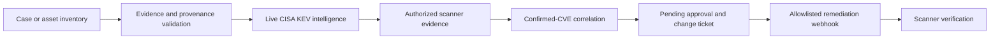

# Full-stack SI sub-agent and integration architecture

Consult [VISION_AND_SCOPE.md](VISION_AND_SCOPE.md) and the
[specialist contract](docs/specialist-agent.md). The product vision is a
full-stack SI sub-agent whose implemented core provides callable,
provenance-aware evidence analysis to coordinating agents. The email-inspired
workspace is its human-facing control plane, not the primary product.

Agent task intake, bounded analysis, durable evidence and provenance history,
human review and report release, and explicitly authorized execution retain
distinct functional and authorization boundaries. Persistent filing supports
human organization without changing evidentiary status or review authority.
The [GitHub control panel](docs/github-control-panel.md) provides a separate
owner-authorized interface for named execution tasks.

Apply [KNOWING FIELD](VesselFramework_Knowing_Field_SKILL_v0.1.md), the fifth
pillar, across these analytical methods. Case/agent outputs carry inquiry
status; human report release requires a source-bound completion record and
separate approval. Domain tools, workflow receipts and historical examples
do not automatically establish completed inquiry or field efficacy.

The [game architecture skill](GAME_DEVELOPMENT_SKILL.md) covers original and
paused game components. `python -m vessell.workflow` runs the adapted bounded
analyst workflow; `python -m vessell.game_architecture` inventories the pinned
game and paused source snapshots without executing game code.

The [Hail game integration](docs/game-integration.md) adds local seeded
autonomous FPS comparison and a Python-backed provenance/correction game.
Run `python -m vessell.game_bridge --help` for the loopback server and
comparison runner. This is fictional local game play, not a production or
external-action connector.

The local package includes a tool catalog and explicit local-file adapters.
Run `vessell-tools list` to see decoding, metadata, cryptography, and OSINT
integrations, and `vessell-tools doctor` to check which command-line tools are
installed. Read-only inspection is available only for allow-listed local
artifacts. OpenPGP decryption requires an explicit authorization flag, uses
the local GnuPG keyring, and refuses to overwrite output. Network OSINT and
active reconnaissance tools are catalog-only; they must not be run without
lawful purpose and explicit scope. See [docs/tool-integrations.md](docs/tool-integrations.md).

# VessellFramework Operational Master

This is the package-level map for VessellFramework skills, agents, executable code, and the authorized defensive workflow. Historical artifacts retain their original `VesselFramework` names for provenance; active code uses the `vessell` namespace.

## Operating Model

The following diagram describes the authorized defensive integration, not
the complete sub-agent architecture. The general service architecture and
its review and execution boundaries are defined in the product vision.



The model agent, public-web OSINT, and vendor/product correlation may supply leads or review context. Only an authorized scanner-confirmed CVE can create a remediation action eligible for approval or dispatch.

## Skills and Agents

| Area | Canonical skill or agent | Executable surface |
|---|---|---|
| Core evidence, provenance, Harm Gate | [SKILL.md](SKILL.md) | `vesselframework_case_runner.py`, `vessell.app.pipeline` |
| Evidence-assurance validation | [Vessel_Evidence_Assurance_Validation_Orchestrator_SKILL_v0.1.md](Vessel_Evidence_Assurance_Validation_Orchestrator_SKILL_v0.1.md) | `vesselframework_reference_v1.1_provenance_firewall.py` |
| Intelligence briefing | [Vessel_Intelligence_Briefing_Policy_SKILL_v0.1.md](Vessel_Intelligence_Briefing_Policy_SKILL_v0.1.md) | Case reporting modules |
| Forecasting | [VesselFramework_Forecasting_SKILL_v1.0.md](VesselFramework_Forecasting_SKILL_v1.0.md) | `vesselframework_agent.py` (analyst workflow), `vessell.evaluation` (retrospective scoring; not validated forecast generation) |
| Agentic SOC analysis | [VesselFramework_Agentic_SOC_Analyst_SKILL_v0.1.md](VesselFramework_Agentic_SOC_Analyst_SKILL_v0.1.md) | `vessell.agentic_soc`, `vessell.agentic_soc_adapter` |
| Adversarial / Evil Twin review | [VesselFramework_Evil_Twin_Adversarial_Analyst_SKILL_v0.1.md](VesselFramework_Evil_Twin_Adversarial_Analyst_SKILL_v0.1.md) | `VesselFramework_SingleFile_EvilTwin_v0.2.py` |
| Recognition assurance | [VesselFramework_Startle_Gate_Defence.md](VesselFramework_Startle_Gate_Defence.md) | `VesselFramework_SingleFile_EvilTwin_v0.2.py` |
| Security-control selection | [Security_Control_Selection_Placement_Analyst_SKILL_v0.1.md](Security_Control_Selection_Placement_Analyst_SKILL_v0.1.md) | Defense plan output |
| Cyber-range analysis | [XP_Cyber_Range_Challenge_Analyst_SKILL_v0.1.md](XP_Cyber_Range_Challenge_Analyst_SKILL_v0.1.md) | Range exercises only |
| Cyber-range master challenge | [XP_Cyber_Range_Master_Challenge_Skill_v0.2.md](XP_Cyber_Range_Master_Challenge_Skill_v0.2.md) | Range exercises only |
| Skill authoring | [VesselFramework_Skill_Creator_SKILL_v0.1.md](VesselFramework_Skill_Creator_SKILL_v0.1.md) | Documentation/skill lifecycle |

## Executable Workflow

Use the workspace Python environment:

```bash
.venv313/bin/python -m pytest
```

### Run the Master Safely

The Markdown file is the operational guide; this paired launcher executes its non-destructive stages in sequence: live CISA KEV intake, evidence report creation, and an approval-gated defense plan. It never starts a scanner, approves an action, dispatches a webhook, or starts the remediation service.

```bash
.venv313/bin/python run_operational_master.py --run-tests
```

Use the `Run Operational Master` VS Code task or launch profile for the same workflow.

### Pre-Live Automation

Run the preflight before starting the Control Room or any live endpoint:

```bash
.venv313/bin/python run_preflight.py --strict
```

It checks the Python runtime, orchestrator dependencies, Trivy/OSV-Scanner availability, authorized inventory state, non-placeholder local secrets, and Microsoft Intune credentials when an authorized asset selects that provider. It performs no scan, network dispatch, or credential output. A nonzero exit means the service is not live-ready.

### 1. Deterministic Case Analysis

```bash
.venv313/bin/python -m vessell.app.main --input example_case.json
```

### 2. Live Exploited-Vulnerability Intake

```bash
.venv313/bin/python run_live_kev_case.py
```

This fetches CISA's official KEV JSON catalog and writes evidence-classified reports under `outputs/case_runs/`.

### 3. Scanner Evidence Ingestion

```bash
.venv313/bin/python run_scanner_ingest.py \
	--inventory example_asset_inventory.json \
	--asset-id YOUR_AUTHORIZED_ASSET_ID \
	--source greenbone \
	--report /path/to/export.json
```

Supported source labels: `greenbone`, `trivy`, `osv-scanner`, and `wazuh`. Scanner exports update `confirmed_cves` only for an existing `authorized: true` asset. Local filesystem/source scans are available only through installed Trivy or OSV-Scanner binaries; they do not scan network targets.

### 4. Active Defense Plan

```bash
.venv313/bin/python run_active_defense.py --inventory example_asset_inventory.json
```

The output is a reviewable plan. Vendor-only and vendor/product correlations are `REVIEW_REQUIRED`; only `scanner_confirmed_cve` actions can become `PENDING_APPROVAL`.

### 5. Remediation Orchestrator

Copy `.env.example` to `.env` and replace every placeholder with local secrets. The `.env` file is ignored by Git.

```bash
.venv313/bin/vf-remediator
```

The service binds to `127.0.0.1:8000` by default. It fails closed if required configuration is missing. Approval requires an authenticated token and change ticket. Webhook assets use HMAC-signed, idempotent dispatch to the configured HTTPS allowlist. Assets configured with `remediation_provider: microsoft-intune` require an `intune_device_id` plus local Microsoft tenant, application ID, and client-secret settings; their approved action requests a Microsoft Graph `syncDevice` operation, while patch policy remains Intune-owned. Completion requires scanner verification.

Open `http://127.0.0.1:8000/` for the **Control Room**. It displays the action queue, polls service state, synchronizes live CISA KEV data with an approval token, and provides ticketed approval and scanner-verification controls. Tokens stay in the active browser form only and are not written to disk by the dashboard.

## Model-Mediated Analyst Agent

`vesselframework_agent.py` supports bounded, read-only public-web analysis. It does not execute local commands, authenticate to remote systems, bypass access controls, or establish facts without provenance.

```bash
.venv313/bin/python vesselframework_agent.py --dry-run --case example_case.json
```

Configure `VESSELFRAMEWORK_API_KEY`, plus optional `VESSELFRAMEWORK_MODEL` and `VESSELFRAMEWORK_BASE_URL`, only in your local environment. Use `/reset` for a new interactive context and `/quit` to leave it.

## VS Code Entry Points

Use **Tasks: Run Task** or the Run and Debug dropdown:

- `Run VessellFramework Full Program Demo`
- `Run VessellFramework Preflight`
- `Run Live CISA KEV Case`
- `Import Authorized Scanner Export`
- `Run Local Authorized Scanner`
- `Build Active Defense Plan`
- `Run KEV Remediation Orchestrator`

The orchestrator will not start until `.env` is configured. The example inventory remains intentionally unauthorized and must be replaced with assets you are authorized to manage.
# Optional local analysis integrations

The local package includes a tool catalog and explicit local-file adapters.
Run `vessell-tools list` to see decoding, metadata, cryptography, and OSINT
integrations, and `vessell-tools doctor` to check which command-line tools are
installed. Read-only inspection is available only for allow-listed local
artifacts. OpenPGP decryption requires an explicit authorization flag, uses
the local GnuPG keyring, and refuses to overwrite output. Network OSINT and
active reconnaissance tools are catalog-only; they must not be run without
lawful purpose and explicit scope. See [docs/tool-integrations.md](docs/tool-integrations.md).
# Operational case-study entry point

The 3.9.0 release adds `vessell-study --spec
case_studies/claim_correction/spec.json --output-dir outputs/study-001`.
It compares real local JSON consumers, persists SQLite receipts and verifies
correction writes before acknowledgment. See
[operational case studies](docs/operational-case-studies.md) for scope, source
findings and evidence limitations. Existing authorization controls remain.
